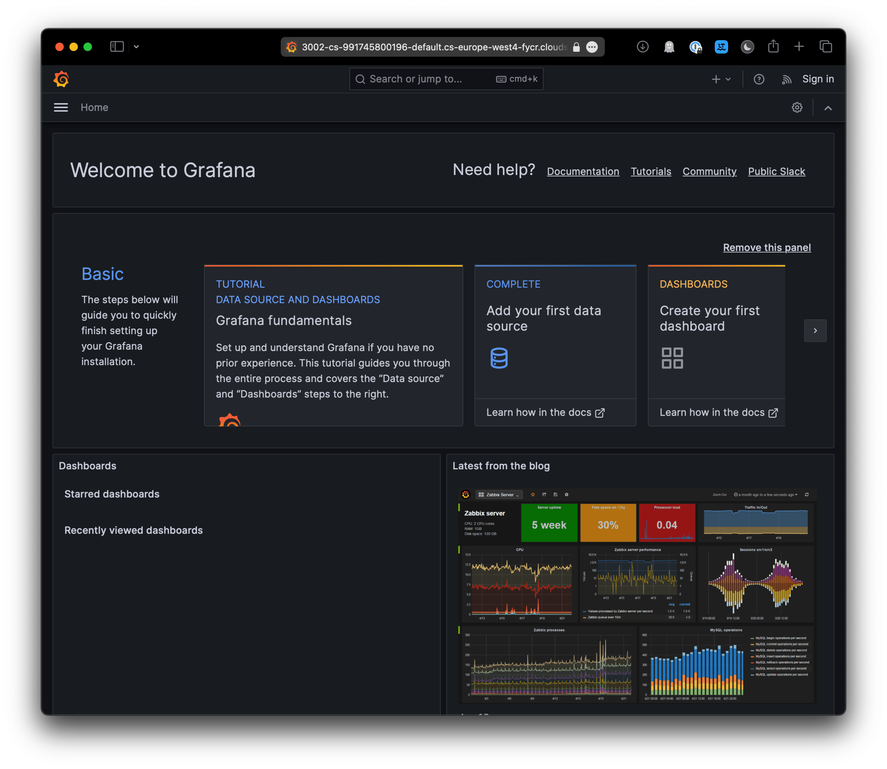
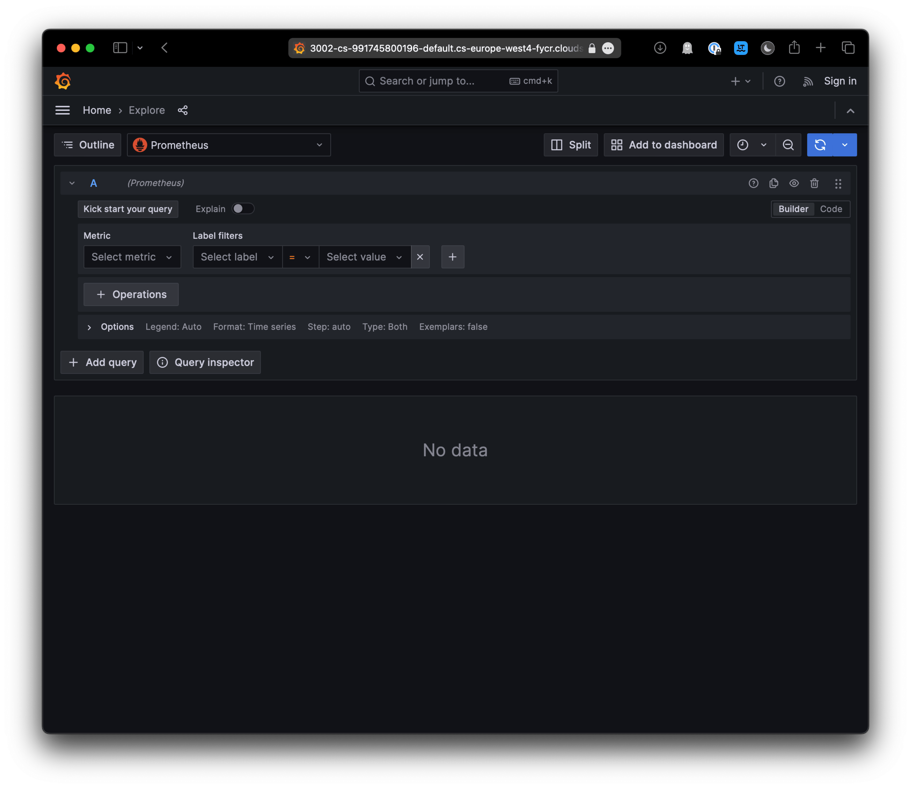
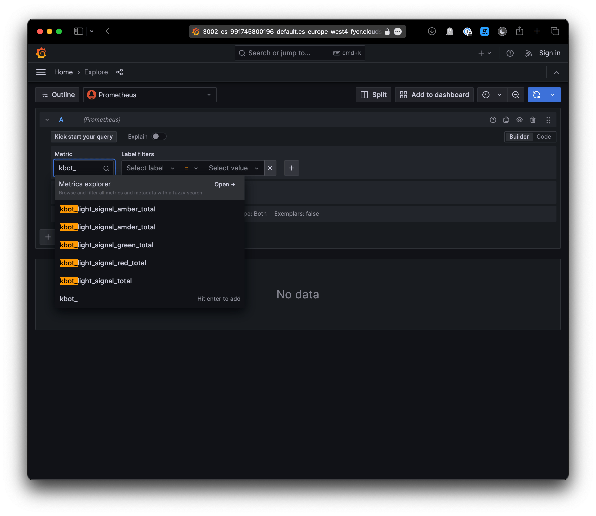
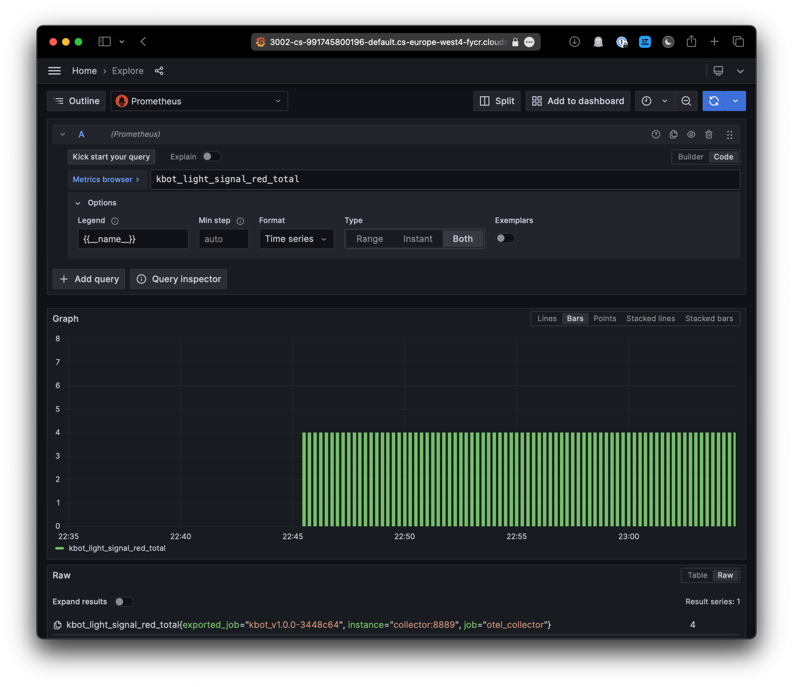
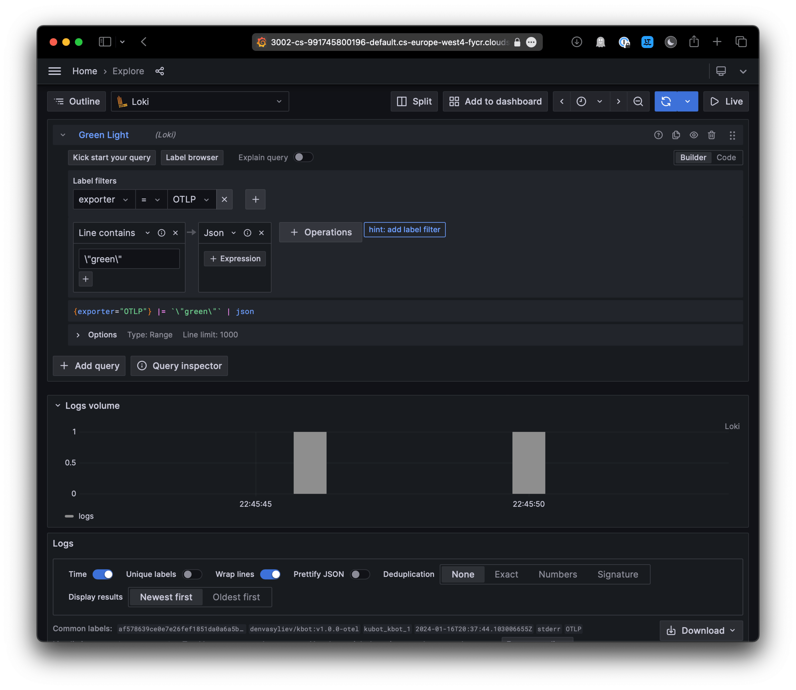
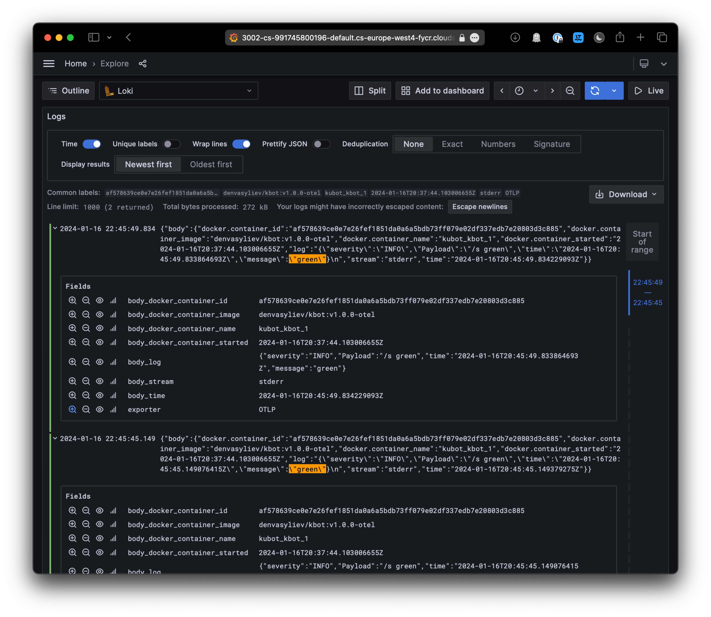
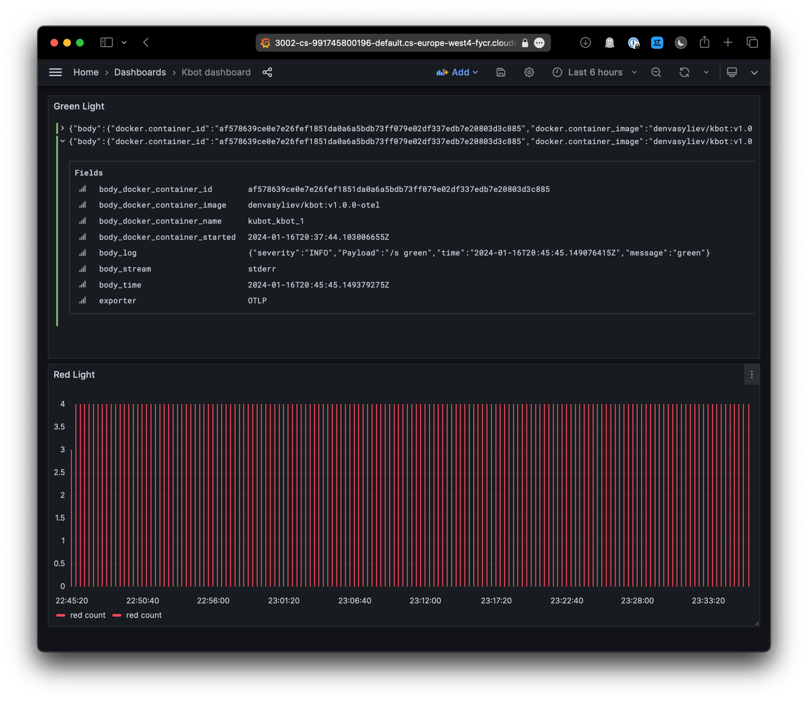

# Відстежуваність з OpenTelemetry

Для відстеження стану та продуктивності застосунку/проєкту завжди є потреба в отриманні телеметрії про його стан. Для цього є велика кількість інструментів. Крім інструментів, потрібно щоб сам застосунок генерував логи про свою роботу, тому скористуємося готовим образом `denvasyliev/kbot:v1.0.0-otel` демо-застосунка.

Для збору та візуалізації моніторингу використовуємо [OpenTelemetry Collector](https://opentelemetry.io/docs/collector/) – **OpenTelemetry Collector** пропонує незалежну від постачальника телеметрії реалізацію того, як отримувати, обробляти та експортувати телеметричні дані. Це усуває необхідність запускати, експлуатувати та підтримувати кілька агентів/колекторів. Локальний агент Collector – стандартне місце, куди бібліотеки експортують свої телеметричні дані. 

Для обробки та візуалізації телеметрії використовуватимемо **Loki**, **Prometheus**, **Fluent Bit** та **Grafana**.

[Loki](https://grafana.com/docs/loki/latest/) – це горизонтально масштабована, високодоступна, багатокористувацька система агрегації логів, створена під враженням від Prometheus. Вона створена для того, щоб бути дуже економічно ефективною та простою в експлуатації. Вона не індексує вміст логів, а скоріше призначає набір міток для кожного потоку логів.

[Prometheus](https://prometheus.io/docs/introduction/overview/) – система моніторингу та сповіщення з відкритим кодом створена в [SoundCloud](https://soundcloud.com/). Prometheus збирає та зберігає свої метрики як дані часових рядів, тобто інформація про метрики зберігається з міткою часу, в якій вона була записана, поряд з необов'язковими парами ключ-значення, які називаються мітками (label).

[Fluent Bit](https://fluentbit.io/) – це надзвичайно швидкий, легкий і добре масштабований процесор логів, метрик та трейсів. Це кращий вибір для хмарних та контейнерних середовищ.

[Grafana](https://grafana.com/oss/grafana/) – рішення для візуалізації та моніторингу даних з відкритим кодом, яке дозволяє робити обґрунтовані рішення, підвищує продуктивність системи та спрощує усунення несправностей.

## Передумови

- [Linux](https://linux.org/pages/download/)
- [Docker](https://docs.docker.com/desktop/)
- [Docker Compose](https://docs.docker.com/compose/)

## Запуск

1. Додамо токен для доступу до Telegram API 
    
    ```sh
    read -s TELE_TOKEN
    export TELE_TOKEN=$TELE_TOKEN
    ```

2. Запуск
    
    ```sh
    docker compose up -d
    ```

    Параметр `-d` запускає процес у фоновому режимі, за потреби налагодження можна запускати без нього, або переглядати логи командою `docker compose logs`.

3. Взаємодія з ботом
   
   - `/start` – для отримання початкових інструкцій
     - `Usage: /s red|amber|green`
   - `/s red` – надсилання команди
     - `Switch red light signal to 1` - відповідь на команду, повторне надсилання – `Switch red light signal to 0`


## Моніторинг

Дашбоард Grafana <http://127.0.0.1:3002>



Меню `home` -> `explore`



Оберемо метрику `kbot_*`



Переглянемо відомості по сигналу `red`



Перемкнемось на Loki та відфільтруймо лог для сигналу `green`



Розпарсимо json



Демо дашбоард


